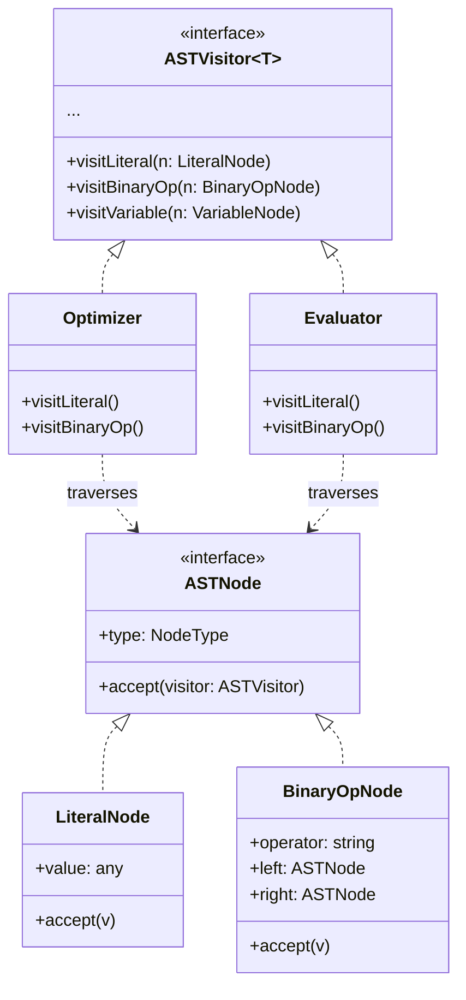
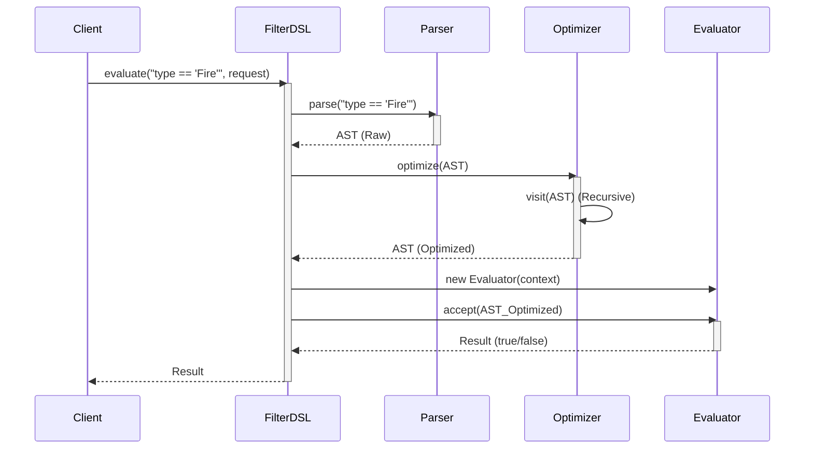
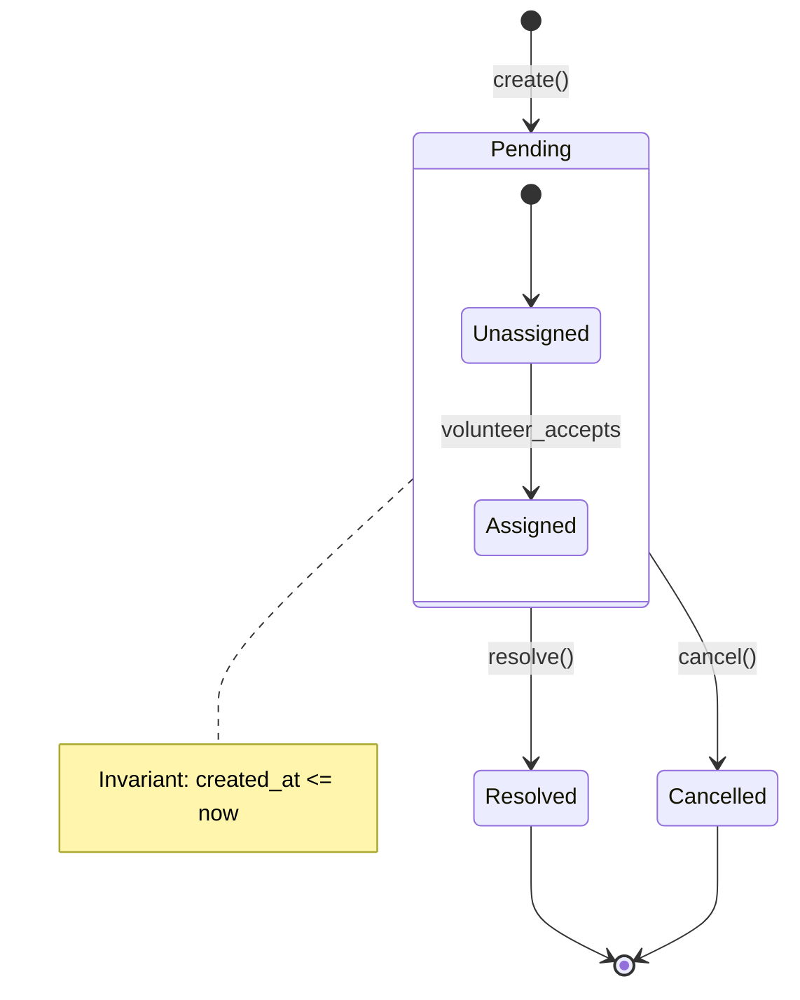

# Software Design Models (UML)

This document applies Unified Modeling Language (UML) to visualize and reason about the system's design.

## 1. Domain Object Model (DSL) - Class Diagram
This diagram illustrates the **Visitor Pattern** implemented in the customized DSL. It shows the separation between the Data Structure (AST Nodes) and the Operations (Visitors).

## 2. Interaction Model - Sequence Diagram
This diagram captures the **Dynamic Behavior** of the `EmergencyFilterDSL` pipeline, specifically the `evaluate` operation. It highlights the precise order of parsing, optimization, and evaluation.

## 3. Lifecycle Model - State Diagram
This diagram models the lifecycle of an `EmergencyRequest`. It helps reasoning about valid state transitions (validating our "Correctness by Construction" and Invariants).

